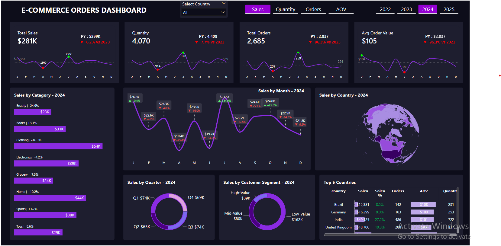

# E-Commerce Orders Dashboard

## Dashboard Purpose

This dashboard helps e-commerce stakeholders gain clear insights into sales trends, top-performing categories, geographic contributions, and customer segments. It supports data-driven decisions to prioritize strategies for recovery and growth amid recent performance challenges.

The design emphasizes clean data modeling, thorough data cleaning, dynamic parameters, and thoughtful visualization choices for maximum clarity and interactivity.

## What’s Inside This Dashboard?

- **Key Performance Indicators (KPIs)**  
  Total Sales, Total Quantity Sold, Total Orders, and Average Order Value (AOV) with Year-over-Year comparisons

- **Breakdowns & Trends**  
  - Sales and Quantity by Category  
  - Sales by Country (with interactive globe visualization)  
  - Monthly and Quarterly Trends  
  - Customer Segment Analysis (High-Value, Mid-Value, Low-Value)

- **Interactivity Features**  
  - Dynamic tabs to switch views between Sales, Quantity, Orders, and AOV  
  - Year selector (2022–2025)  
  - Country filter dropdown

## Key Insights

- Sales peaked at **$468K in 2023** (+9.4% vs 2022), declined to **$433K in 2024** (-7.5%), and are tracking at approximately **$267K year-to-date in 2025** (as of late December).
- Quantity sold followed a similar trajectory: growth into 2023 followed by consistent declines.
- Total Orders and AOV also peaked in 2023 before softening, indicating fewer transactions and slightly lower basket values.
- **Clothing** remains the top-performing category across years, supported by strong contributions from **Toys** and **Beauty** during growth periods.
- Top contributing countries include **India**, **Brazil**, and **Germany**, with India frequently leading in sales share (up to 26–28%) and demonstrating strong AOV.
- **High-Value customers** are the most important segment but show signs of softening in recent years.

## Tools & Techniques Used

- **Power BI Desktop** – Primary visualization and dashboard platform
- **Power Query** – Data cleaning and transformation
- **DAX** – Custom measures, calculated columns, and dynamic parameters
- Basic wireframing for optimal layout planning

This dashboard empowers stakeholders to quickly identify performance drivers, detect emerging challenges, and focus efforts on high-impact areas for sustained growth.---

*Screenshot captured from a sample e-commerce analytics dashboard (2024 data shown).*
