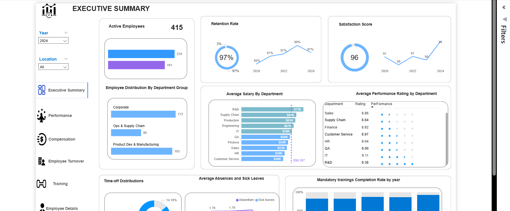
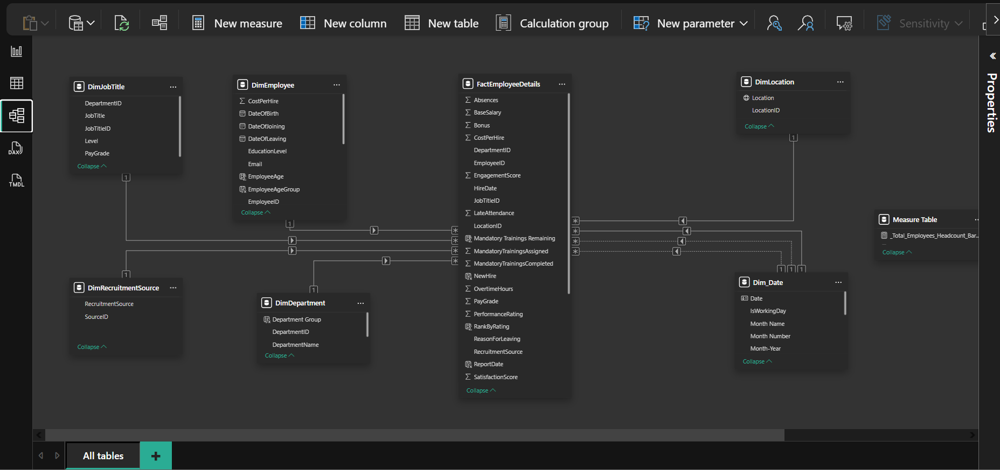
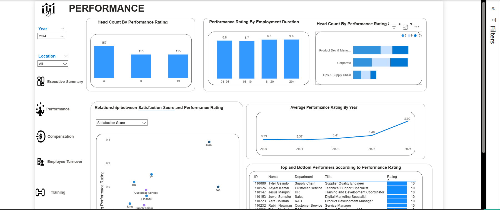
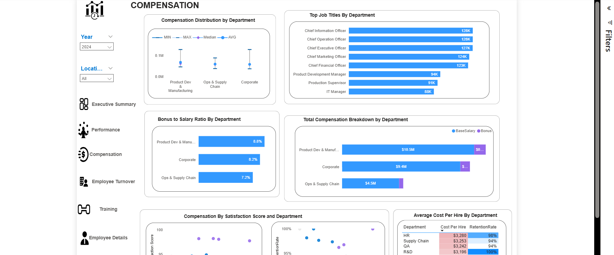
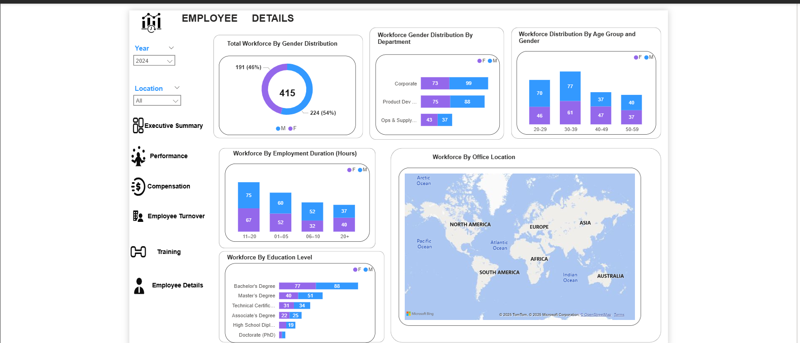
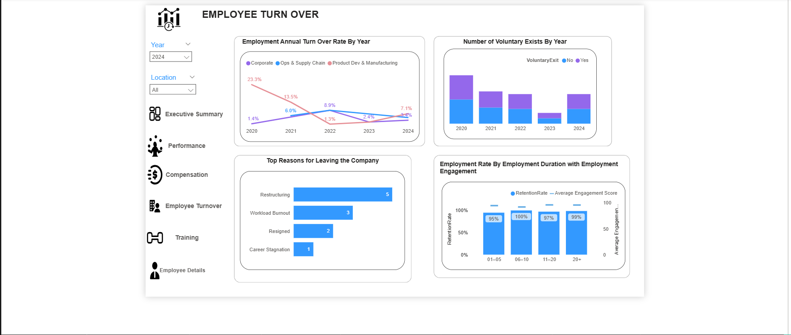
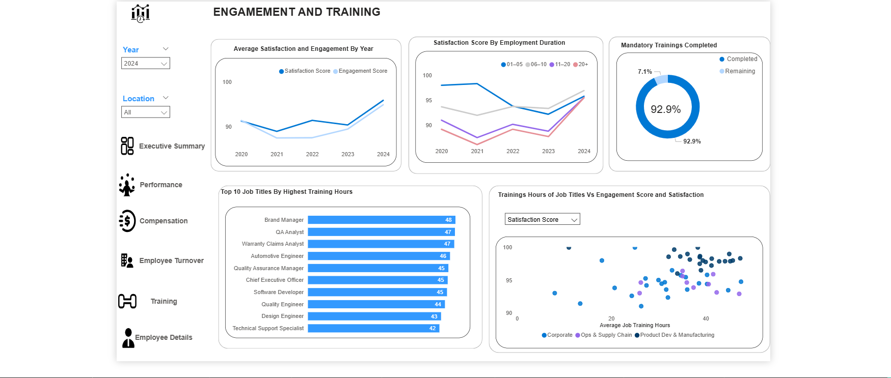

# HR Analytics Dashboard

**Your all-in-one Power BI HR analytics hub – smart, visual, and actionable!**  

Track **415 employees** across **performance**, **compensation**, **turnover**, **training**, and **engagement** with real-time insights. Turn raw HR data into strategic decisions — no spreadsheets needed.

Perfect for **HR leaders**, **managers**, and **executives** who want to boost retention, optimize costs, and build a high-performing workforce.

---

## Data Model – Star Schema (Clean & Scalable)  

Built on a **robust star schema** for performance and accuracy:

### Fact Table
- `FactEmployeeDetails` – Core employee data (salary, performance, hire date, etc.)

### Dimension Tables
- `DimEmployee` – Personal info (age, gender, email, education)
- `DimJobTitle` – Roles, departments, pay grades
- `DimDepartment` – Department groups (R&D, Sales, etc.)
- `DimLocation` – Office locations (global map ready)
- `DimDate` – Time intelligence (year, month, trends)
- `DimRecruitmentSource` – Hiring channels

> **One-to-many relationships** from dims → fact  
> **Date table linked** via `ReportDate` for time-based analysis  
> **20+ DAX measures** for headcount, turnover %, cost per hire, etc.

---

## Why This Dashboard Works So Well

- **Live insights**: Data refreshed **November 7, 2025**
- **Drill-down ready**: Click any department, job title, or employee
- **Mobile optimized**: Clean layout for any device
- **Smart visuals**: Donuts, maps, trend lines, scatter plots
- **Interactive filters**: Year, Location, Department, Satisfaction Score

---

## Key Insights Right Now

| Metric | Value | Insight |
|-------|-------|--------|
| **Total Headcount** | **415** | Stable workforce |
| **Retention Rate** | **97%** | Excellent – up from 95% in 2020 |
| **Satisfaction Score** | **96** | Highest ever – strong culture |
| **Average Performance** | **8.90 / 10** | Consistent high performers |
| **Top Department (Salary)** | **R&D** – $72K avg | Innovation pays |
| **Highest Turnover Risk** | **Product Dev & Manufacturing** – 23.3% | Act now |
| **Cost Per Hire (HR)** | **$3,280** | Most efficient recruiting |
| **Training Completion** | **92.9%** | Near-perfect compliance |

---

## 6 Powerful Pages to Explore

### 1. **Executive Summary** – Leadership View

- KPIs: Headcount, Retention, Satisfaction
- Department distribution & salary benchmarks
- Performance ratings by department

> **Quick Win**: **R&D leads in salary & performance**

---

### 2. **Performance** – Who’s Thriving?

- Headcount by rating (8, 9, 10)
- Performance vs tenure scatter
- Top 10 performers list
- Trend: Avg rating up to **8.90** in 2024

> **Insight**: Longer tenure = higher ratings (11–20+ years)

---

### 3. **Compensation** – Fair Pay, Smart Spend

- Salary distribution (min, max, median, avg)
- Bonus-to-salary ratio by department
- Top job titles: **CIO ($128K)**
- Cost per hire by department

> **Action**: **Product Dev** bonus ratio only **8.9%** – review incentives

---

### 4. **Employee Details** – Know Your People

- Gender: **54% Female**, **46% Male**
- Age groups & education levels
- Global office map (North America dominates)
- Employment duration breakdown

> **Diversity Note**: Strong gender balance, room to grow in 50+ age group

---

### 5. **Employee Turnover** – Stop the Leak

- Turnover rate by year & department
- Top exit reasons: **Restructuring (5)**, **Burnout (3)**
- Voluntary exits down in 2024
- Retention vs engagement correlation

> **Urgent**: **Product Dev** turnover at **23.3%** – investigate workload

---

### 6. **Engagement & Training** – Invest in Growth

- Satisfaction & engagement trends
- Top 10 roles by training hours
- Mandatory training: **92.9% completed**
- Training hours vs satisfaction scatter

> **Success**: **Brand Manager (48 hrs)** leads in training investment

---

## How It’s Built (Clean & Professional)

- **Power Query**: Merged sources, cleaned dates, added age groups
- **DAX Measures**: 
  - `Headcount = DISTINCTCOUNT(EmployeeID)`
  - `Turnover % = DIVIDE([Leavers], [Avg Headcount])`
  - `Cost Per Hire`, `Bonus Ratio`, `Rank by Rating`
- **Visuals**: Cards, donuts, bar charts, world map, scatter, line trends
- **Design**: Blue & purple theme, tooltips, drill-through, bookmarks

---

> **Last updated**: November 07, 2025 11:15 AM EAT  
> **Email**: [tongjohn308@gmail.com](mailto:tongjohn308@gmail.com)  
> **Author on Linkedin**: [@John Tong](https://www.linkedin.com/in/johntong123)  
> **Location**: 🇺🇬 Uganda

---

