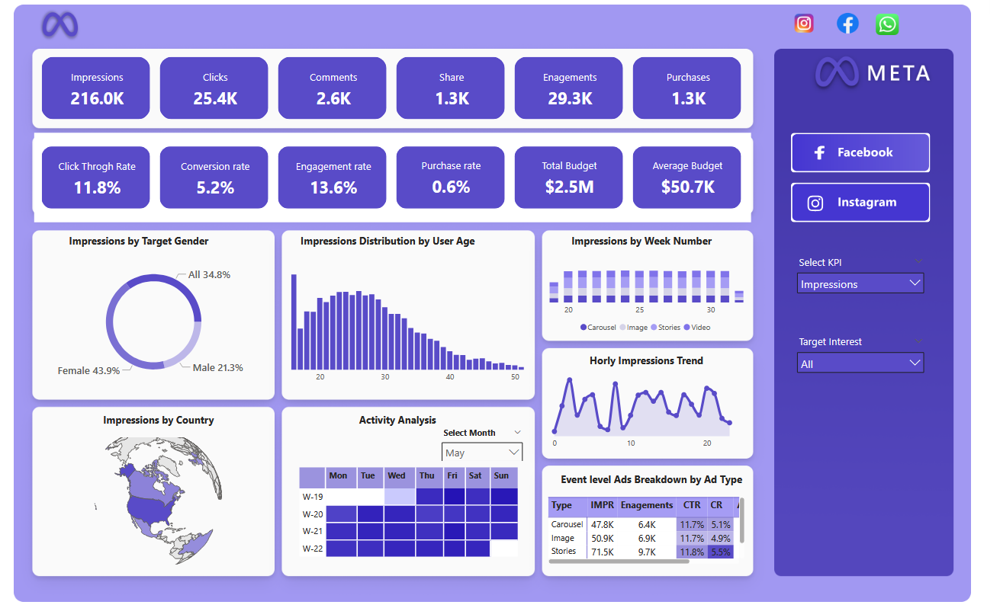

# Meta Ads Performance Dashboard

I'm excited to share a **Meta Ads Performance Dashboard** I've built using a realistic Meta Ads dataset that mirrors how Facebook and Instagram advertising platforms capture and report campaign data.

The dataset includes detailed information on campaigns, ad creatives, user demographics (age, gender, location), and ad interaction events.

This interactive dashboard is designed to help marketing teams **analyze and optimize paid campaigns** across **Facebook** and **Instagram** by providing clear, actionable insights into key advertising KPIs.

## Project Objective

To track and evaluate the performance of advertising campaigns on Facebook and Instagram, offering visibility into:
- Reach & Impressions
- Engagement patterns
- Conversion funnel efficiency
- Budget utilization and ROI

This enables data-driven decisions to:
- Compare platform effectiveness (Facebook vs Instagram)
- Optimize budget allocation
- Identify high-performing audience segments
- Improve return on ad spend (ROAS)

## Key KPI Metrics Overview

| Metric                  | Value     | Insight                                                                 |
|-------------------------|-----------|-------------------------------------------------------------------------|
| **Impressions**         | 216K      | Strong reach – ads were displayed frequently                              |
| **Clicks**              | 25.4K     | Solid interest from the audience                                         |
| **Purchases (Conversions)** | 1.3K  | Real customer acquisitions driven by ads                                 |
| **Engagements**         | 29K       | High interaction (likes, shares, comments, clicks)                        |
| **CTR (Click-Through Rate)** | 11.76% | **Excellent** – far above industry average (~1-2%) → highly attractive creatives |
| **Engagement Rate**     | 13.56%    | Very strong audience interaction                                         |
| **Conversion Rate**     | 5.21%     | Good rate from clicks to purchases                                       |
| **Purchase Rate**       | 0.61%     | Low end-to-end conversion from impressions → opportunity to optimize funnel |
| **Total Budget**        | $2.5M     | Significant ad spend across campaigns                                    |
| **Avg Budget per Campaign** | $50.7K | Indicates multiple active campaigns                                      |

## Dashboard Features

- Top-line KPI cards for quick performance snapshot
- Platform comparison (Facebook vs Instagram)
- Demographic breakdowns (Gender, Age, Country)
- Hourly and weekly engagement/share trends
- Ad type performance analysis (Video, Image, Carousel, Stories)
- Monthly calendar view
- Filters for Metrics, Campaign, Target Interest, and more

## Tools Used

- **Power BI Desktop** – Primary visualization and dashboard building
- **Power Query** – Data transformation and cleaning
- **Figma** – UI/UX design and mockups

## Dataset

The dataset simulates real-world Meta Ads Manager data, including:
- Campaign and ad-level metrics
- Demographic targeting results
- Event-based interactions (impressions, clicks, engagements, conversions)

## How to Use

1. Download the `.pbix` file (if shared)
2. Open in Power BI Desktop
3. Explore filters and drill-downs for deeper insights

