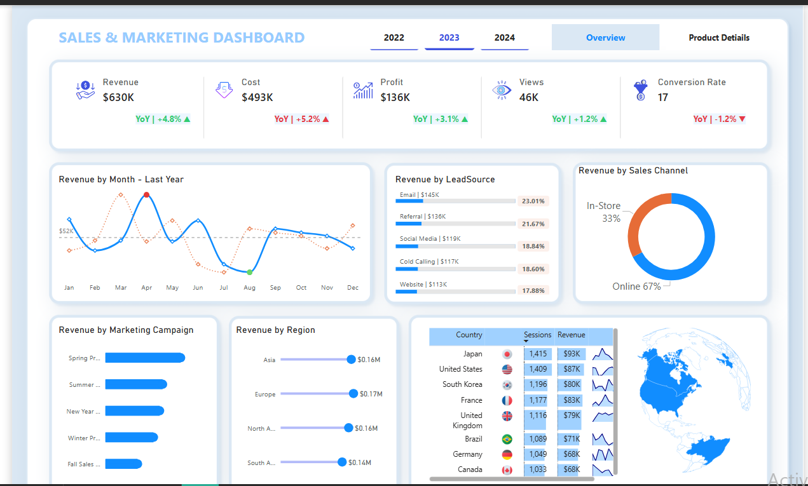
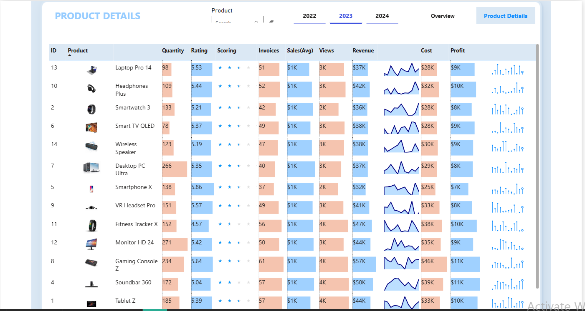

# Sales & Marketing Dashboard

A modern, interactive **Sales & Marketing Dashboard** built in **Microsoft Power BI** to provide clear insights into revenue trends, marketing campaign performance, lead sources, sales channels, regional distribution, and detailed product-level metrics.

This dashboard helps stakeholders quickly understand business performance, identify growth opportunities, and make data-driven decisions.

## 📊 Dashboard Overview

The dashboard consists of two main pages:

### 1. Overview Page
Provides a high-level summary of key performance indicators (KPIs) and breakdowns across time, channels, campaigns, and geography.

**Key Metrics Displayed:**
- Total Revenue
- Total Cost
- Profit
- Views
- Conversion Rate

**Visualizations:**
- Revenue trend by month (last year comparison)
- Revenue by Lead Source (e.g., Email, Social Media, Referral, Cold Calling, Website)
- Revenue by Sales Channel (In-Store vs Online)
- Revenue by Marketing Campaign (Spring Pr., Summer, New Year, etc.)
- Revenue by Region (Asia, Europe, North America, South America)
- Top countries by sessions and revenue (table + world map)

### 2. Product Details Page
Drill-down view focused on individual product performance.

**Columns Include:**
- Product ID & Name
- Quantity Sold
- Rating
- Scoring
- Invoices
- Sales Avg
- Views
- Revenue
- Cost
- Profit
- Mini sparkline charts for revenue/profit trend

### Overview Page

## 🎯 Key Insights Enabled
- Track year-over-year revenue, cost, and profit growth
- Identify most effective lead sources and marketing campaigns
- Understand channel performance (in-store vs online)
- Spot high-performing regions and countries
- Analyze product-level profitability and popularity

### Product Details Page

