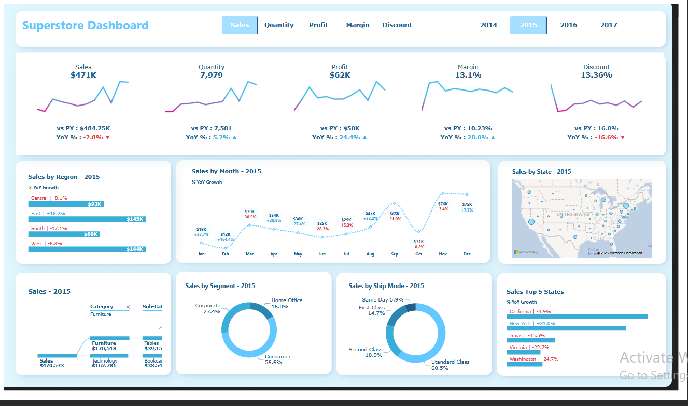

# Superstore Sales Dashboard 📊

Interactive sales dashboard built using the famous **Superstore Dataset** from Kaggle, visualizing key business metrics, regional performance, trends, and customer segments.

## Dataset
- **Source**: [Superstore Dataset (Final) on Kaggle](https://www.kaggle.com/datasets/vivek468/superstore-dataset-final)
- **Rows**: ~10,000 orders
- **Time Period**: 2014 – 2017
- **Categories**: Furniture, Office Supplies, Technology
- **Segments**: Consumer, Corporate, Home Office
- **Regions**: Central, East, South, West (US)

## Dashboard Highlights (2015 Focus)

### Key Metrics
| Metric        | 2015 Value     | YoY Change       |
|---------------|----------------|------------------|
| Sales         | **$471K**      | -2.8% (decline)  |
| Quantity      | **7,979**      | +5.2% (growth)   |
| Profit        | **$62K**       | +24.4% (growth)  |
| Margin        | **13.1%**     | +28.0% (growth)  |
| Discount %    | **13.36%**     | -16.6% (reduced) |

### Insights from 2015
- Profit grew strongly (+24.4%) despite a slight drop in sales
- Average discount reduced significantly, contributing to higher margins
- West & East regions lead in sales; South lags behind
- Consumer segment dominates (56.6%), followed by Corporate (27.4%)
- Standard Class shipping used in 60% of orders
- Top performing states: California (+3.9%), New York (+3.0%)

## Dashboard Views
- Year selector (2014–2017)
- Sales, Quantity, Profit, Margin & Discount trend lines
- Regional & state-level performance
- Monthly sales trend
- Sales by category & sub-category
- Customer segment breakdown
- Shipping mode distribution
- Top 5 states by YoY growth

## Tools Used
- Microsoft Power BI
- Figma for Basic Wireframing
- Power Query for transformation and cleaning

